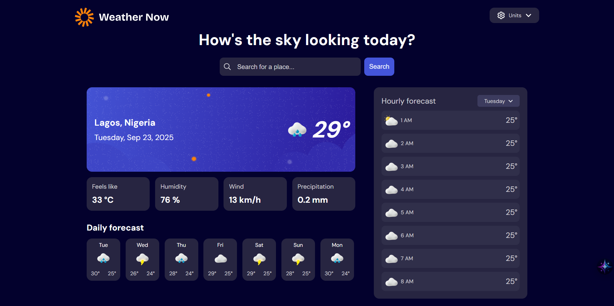

# Frontend Mentor - Weather app solution

This is a solution to the [Weather app challenge on Frontend Mentor](https://www.frontendmentor.io/challenges/weather-app-K1FhddVm49). Frontend Mentor challenges help you improve your coding skills by building realistic projects. 

## Table of contents

- [Overview](#overview)
  - [The challenge](#the-challenge)
  - [Screenshot](#screenshot)
  - [Links](#links)
- [My process](#my-process)
  - [Built with](#built-with)
  - [What I learned](#what-i-learned)
  - [Continued development](#continued-development)
  - [Useful resources](#useful-resources)
- [Author](#author)
- [Acknowledgments](#acknowledgments)

## Overview

### The challenge

Users should be able to:

- Search for weather information by entering a location in the search bar
- View current weather conditions including temperature, weather icon, and location details
- See additional weather metrics like "feels like" temperature, humidity percentage, wind speed, and precipitation amounts
- Browse a 7-day weather forecast with daily high/low temperatures and weather icons
- View an hourly forecast showing temperature changes throughout the day
- Switch between different days of the week using the day selector in the hourly forecast section
- Toggle between Imperial and Metric measurement units via the units dropdown 
- Switch between specific temperature units (Celsius and Fahrenheit) and measurement units for wind speed (km/h and mph) and precipitation (millimeters) via the units dropdown
- View the optimal layout for the interface depending on their device's screen size
- See hover and focus states for all interactive elements on the page

### Screenshot



### Links

- Solution URL: [Add solution URL here](https://your-solution-url.com)
- Live Site URL: [Live site URL](https://weather-app-tolu.vercel.app/)

## My process

### Built with

- [Next.js](https://nextjs.org/) — React framework used for server/client rendering.
- [React](https://reactjs.org/) — UI library powering component composition.
- Custom CSS
- [Open-Meteo APIs](https://open-meteo.com/) – Weather data  
- [BigDataCloud API](https://www.bigdatacloud.com/) – Reverse geocoding  

### What I learned

Working on this project helped me sharpen my API integration skills in Next.js. I learned how to manage data from multiple sources (Open-Meteo for weather + BigDataCloud for reverse geocoding).


#### Example utility function I built  

```ts
export function formatTemperature(temp:number, units:Units) {
  const unit = units.temperature === 'fahrenheit' ? '°F' : '°C';
  return `${Math.round(temp)}${unit}`;
}
```
```css
.days-dropdown-contents button:not(:last-child) {
    margin-bottom: 0.5rem;
}
```
Another key takeaway was handling asynchronous requests with error states and loading indicators:
```ts
useEffect(() => {
    const fetchWeather = async () => {
      try {
        setLoading(true);
        const data = await getWeatherData(latitude, longitude, units);
        setWeatherData(data);
        setError(null);
      } catch (err) {
        setError("Failed to fetch weather data");
        console.error("Weather fetch error:", err);
      } finally {
        setLoading(false);
      }
    };

    fetchWeather();
  }, [latitude, longitude, units]);
```

### Continued development

I want to keep improving at handling complex API responses, especially when combining multiple data sources.  
I also plan to focus on optimizing performance in Next.js and deepening my understanding of TypeScript for safer, more scalable code.

### Useful resources  

- [Open-Meteo API Documentation](https://open-meteo.com/en/docs) - Helped me understand how to fetch and customize weather data (current, daily, and hourly forecasts) with different units.  
- [BigDataCloud Reverse Geocoding API](https://www.bigdatacloud.com/docs/api/free-reverse-geocode-to-city-api) - Very useful for converting user coordinates into readable city and country names.  
- [Next.js Documentation](https://nextjs.org/docs) - Cleared up concepts about data fetching and client components.  

## Author

- Website - [Toluwalope Adegoke](https://tolu-a.vercel.app/)
- Frontend Mentor - [@ulot2](https://www.frontendmentor.io/profile/ulot2)
- Twitter - [@Tolu_dev](https://x.com/Tolu_dev)
- LinkedIn - [Toluwalope Adegoke](www.linkedin.com/in/toluwalope-adegoke-b441b9380)

## Acknowledgments

A big thanks to Oluwatobi Adegoke, who is also a web developer, for guiding me through tricky parts of this project.
